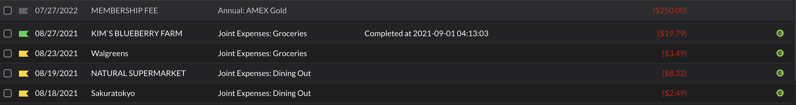
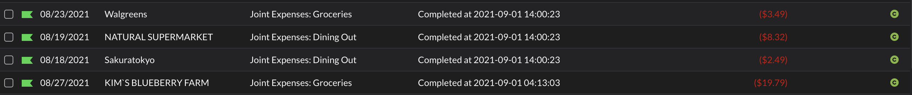
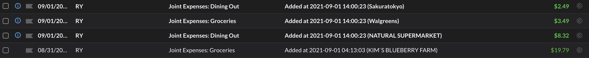

# YNAB Offset Transactions

### Problem
Because of shared expenses, I have an untracked account named "Shared Account". Every time I pay a shared expense i.e. Groceries, I immediately create a credit in "Shared Account".

### What it does
This deployed on AWS Lambda with a CloudWatch Event to run every 1 hour. It will pull all my transactions with yellow tags, and create a credit in my Shared Account, and then switch the tags to green so that it's not picked up again.

My Account (Before)
:----------------------------------------------:

My Account (After)
:----------------------------------------------:

Shared Account (After)
:----------------------------------------------:

